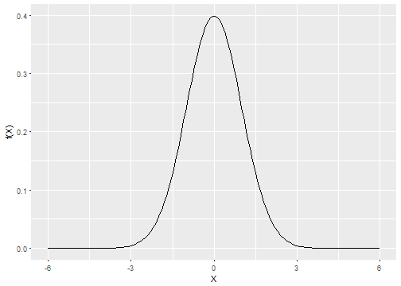

## What is this Shiny app all about?
<br><br>

The purpose of this Shiny app is to allow the user to develop intuition about the **normal curve**.

It allows you to play around with a **normal curve** in the following ways:

* Change the **mean** of the displayed distribution to any integer between -3 and 3 inclusive

* Change the **standard deviation** of the displayed distribution between .5 and 6 in increments of .05

* Choose the **mininum** and **maximum** x values to show on the plot

* **Zoom** in on a portion of the plot by brushing

--- &radio

## Review question

Which one of the following operations does this app implement?

1. Click on plot.
2. Hover over plot.
3. _Brush an area of the plot._
4. Double click on plot.

*** .hint
<br>This operation is used to zoom in on a portion of the plot.

*** .explanation
This app implements **brush**ing an area of the plot.  Brushing is used to select a portion of the plot to zoom in on.

---

## Documentation is included in the app in its own tab
<br><br>
Following is an excerpt from the "Docmentation" tab:

> The main window has two tabs.  The tab labeled "Plot" displays the normal curve as you play around with it.  The tab labeled "Documentation" contains the text you are reading.

> The mean and the standard deviation of the displayed distribution can be changed by use of sliders labeled "Mean:" and "Standard deviation:".

> The minimum and maximum x values to show on the plot can be chosen by use of the slider labeled "Input range:".  If the minimum and maximum x values are set equal to each other, an error message will be displayed.

> Brushing an area of the display will zoom in using the minimum and maximum x values of the brushed area.  The values for the normal curve at these x values will be displayed.  An odd byproduct of this approach is brushing a blank area of the display will zoom in on the part of
the normal curve corresponding to the chosen x values---not the blank area itself.

> To stop zooming and go back to the full normal curve, click anywhere outside of the brushed area.

---

## How the plot looks when the app first starts
### (R code evaluated and displayed)


```r
x <- seq(-6, 6, .1)
y <- dnorm(x, 0, 1)
ggplot(data=data.frame(x, y), aes(x=x, y=y)) + geom_line() + labs(x="X", y="f(X)")
```



